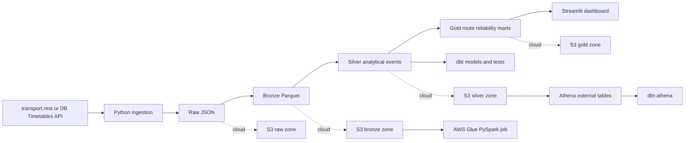

# DB Train Delay and Route Reliability Pipeline

End-to-end data engineering project for collecting German train timetable and delay data, storing raw records, transforming them into analytical tables, and comparing route reliability across short, medium, long, regional, and ICE services.

This repository is built to show practical DE patterns rather than only notebook analysis:

- API ingestion from `transport.rest`
- raw, bronze, silver, and gold data layers
- PySpark transformation module
- dbt models and tests
- AWS-oriented lakehouse design with S3, Glue, Athena, and CI/CD
- Streamlit dashboard over the gold metrics layer

## Why This Project

Train reliability is a strong DE problem because it combines semi-structured API data, operational quality signals, layered storage, analytical modeling, and dashboard delivery in one pipeline.

This project demonstrates how to:

- preserve raw API payloads for replayability
- transform transport events into typed analytical tables
- compare service quality across route types and distances
- model reliability with more than one metric
- design a local-first workflow that can scale into AWS

## Architecture



## How To Run

### Local one-command run

This command creates the Python 3.10 virtual environment if needed, installs dependencies, runs the local pipeline, executes tests, and regenerates README assets:

```powershell
powershell -ExecutionPolicy Bypass -File .\scripts\run_local_stack.ps1
```

To open the dashboard after the local stack completes:

```powershell
.\.venv\Scripts\python.exe -m streamlit run dashboard\app.py
```

### AWS one-command preflight

This command prepares the local Python environment, installs dbt, validates the dbt project, and runs Terraform format checks for the AWS path:

```powershell
powershell -ExecutionPolicy Bypass -File .\scripts\run_aws_preflight.ps1
```

### AWS deploy path

After preflight, deployment still needs your AWS credentials and a unique S3 bucket name:

```powershell
cd infra\terraform
copy terraform.tfvars.example terraform.tfvars
terraform init
terraform apply
```

## Data Sources

This project is designed around two source options:

- Deutsche Bahn Timetables API: official DB timetable and change endpoints for station and planned or changed departure data  
  Source: [DB API Marketplace - Timetables](https://developers.deutschebahn.com/db-api-marketplace/apis/product/timetables)
- `transport.rest`: unauthenticated community API for station departures, arrivals, journeys, and stop lookups  
  Source: [v6.db.transport.rest API docs](https://v6.db.transport.rest/api.html)

Current implementation status:

- implemented ingestion client for `transport.rest`
- scaffolded client for the DB Timetables API
- added retry handling for common API failures such as `429` and `503`
- attempted live `transport.rest` ingestion during validation; the service returned HTTP `503` on June 12, 2026, which is a realistic example of why retry handling and raw persistence matter in DE work

## Sample Dataset

The repository includes a small local sample dataset for immediate execution.

Current sample characteristics:

- `18` raw departure records
- `6` target routes
- service dates from `2026-06-01` to `2026-06-12`
- weekday and weekend coverage
- short, medium, long, regional, and ICE routes
- delay events, cancellations, and platform changes

Representative routes:

| Route type | Example |
|---|---|
| Short | Mannheim to Heidelberg |
| Medium | Mannheim to Frankfurt |
| Long | Mannheim to Berlin |
| Long | Munich to Hamburg |
| Regional | Heidelberg to Karlsruhe |
| ICE | Frankfurt to Cologne |

## Data Schema

| Layer | Grain | Format | Purpose | Key columns |
|---|---|---|---|---|
| Bronze | One raw source event | JSON and Parquet | Preserve source-aligned records for replay | `route_id`, `station_id`, `train_name`, `planned_departure`, `ingested_at`, `source` |
| Silver | One cleaned analytical departure event | Parquet | Typed delays, flags, timestamps, and event IDs | `event_id`, `route_id`, `delay_minutes`, `is_delayed`, `platform_changed`, `day_part` |
| Gold | One route summary row | Parquet and CSV | Route-level reliability metrics for analytics and dashboarding | `route_id`, `event_count`, `avg_delay_minutes`, `on_time_rate_pct`, `reliability_score` |

Main silver columns:

- `event_id`
- `route_id`
- `station_id`
- `train_name`
- `planned_departure`
- `actual_departure`
- `ingested_at`
- `delay_minutes`
- `is_delayed`
- `platform_changed`
- `service_date`
- `weekday`
- `is_weekend`
- `day_part`

Main gold columns:

- `event_count`
- `avg_delay_minutes`
- `median_delay_minutes`
- `delayed_events`
- `cancellations`
- `platform_changes`
- `delay_frequency_pct`
- `cancellation_rate_pct`
- `platform_change_rate_pct`
- `on_time_rate_pct`
- `delay_per_100_km`
- `reliability_score`

## Reliability Score

The reliability score is an explicit weighted metric on a `0` to `100` scale:

```text
reliability_score
= 100
  - (delay_frequency_pct * 0.45)
  - (cancellation_rate_pct * 0.40)
  - (platform_change_rate_pct * 0.15)
```

Interpretation:

- higher is better
- delay frequency carries the largest weight
- cancellations carry nearly as much weight as delays
- platform changes are treated as a lighter but still meaningful disruption signal

Worked example from the current sample:

For `mannheim_frankfurt`:

- `delay_frequency_pct = 66.67`
- `cancellation_rate_pct = 33.33`
- `platform_change_rate_pct = 33.33`

Score:

```text
100 - (66.67 * 0.45) - (33.33 * 0.40) - (33.33 * 0.15)
= 100 - 30.00 - 13.33 - 5.00
= 51.67
```

Additional custom metric:

- `on_time_rate_pct = ((event_count - delayed_events - cancellations) / event_count) * 100`

## What I Ran

The project was executed locally with Python 3.10 in a repo-scoped virtual environment.

Validated commands:

- `.\.venv\Scripts\python.exe scripts\run_local_pipeline.py`
- `.\.venv\Scripts\python.exe -m pytest`
- `.\.venv\Scripts\python.exe -m ruff check .`
- `.\.venv\Scripts\python.exe scripts\generate_readme_assets.py`
- `streamlit run dashboard/app.py`

Outputs created:

- `data/local/bronze/train_events.parquet`
- `data/local/silver/train_events.parquet`
- `data/local/gold/route_reliability.parquet`
- `data/local/gold/route_reliability.csv`

## Dashboard Outputs

These images were generated from the same gold-layer dataset used by the Streamlit dashboard after running the local pipeline.


## Current Findings

From the current sample run:

- `mannheim_heidelberg` is the strongest route in the sample with `4` events, `3.0` average delay minutes, `75.0%` on-time rate, and a reliability score of `85.0`
- `frankfurt_cologne` and `heidelberg_karlsruhe` both show moderate disruption but still outperform the longer-distance and cancellation-heavy routes
- `munich_hamburg` contains both a cancellation and a delayed event, which drives `on_time_rate_pct` to `0.0`
- `mannheim_berlin` shows the highest average delay minutes at `16.33`
- `mannheim_frankfurt` is the weakest route in this sample with a reliability score of `51.67` because it combines delays, a cancellation, and a platform change

## Why Delays Happened In This Run

The current dataset does not contain root-cause labels such as signal failure, rolling stock issue, weather, or crew shortage, so this project does not claim causal certainty it does not have.

What the data does support:

- long-distance services show higher absolute delay exposure because disruption can accumulate across more stops
- cancellations are a strong reliability hit even when no actual departure timestamp exists
- platform changes are a useful operational disruption indicator even when delay minutes stay modest
- short routes can still show a high normalized delay per 100 km

In a production extension, the next step would be to retain and model source remarks or disruption messages from live API responses.

## dbt Test Coverage

The dbt project includes tests and freshness logic across the modeled layers:

- source freshness on `silver.train_events` using `ingested_at`
- `not_null` checks on key source fields such as `route_id`, `planned_departure`, and `ingested_at`
- `unique` and `not_null` on `stg_train_events.event_id`
- accepted values on `stg_train_events.source`
- accepted range checks on `delay_minutes`
- `unique` and `not_null` on `dim_routes.route_id`
- `unique` and `not_null` on `fct_route_reliability.route_id`
- accepted ranges for `event_count`, `delay_frequency_pct`, `cancellation_rate_pct`, `platform_change_rate_pct`, `on_time_rate_pct`, and `reliability_score`

Freshness policy currently configured:

- warn after `36` hours
- error after `72` hours

Note:

- in this demo project, freshness is tied to `ingested_at`
- in production, `ingested_at` should be written by the ingestion job for every API batch

## CI and Failure Modes

GitHub Actions workflow: [.github/workflows/ci.yml](.github/workflows/ci.yml)

What CI runs:

- Python job
  - install dependencies
  - `ruff check .`
  - `pytest`
  - `python scripts/run_local_pipeline.py`
- Terraform job
  - `terraform fmt -check`
- dbt job
  - install dbt packages
  - copy `profiles.yml.example`
  - `dbt deps`
  - `dbt seed`
  - `dbt parse`

Typical successful run shape on GitHub-hosted runners:

- Python job: around `3` to `6` minutes depending on dependency install time
- Terraform job: usually under `1` minute
- dbt job: around `2` to `4` minutes

What breaks when something is wrong:

- lint failures stop the Python job on import issues, long lines, or style regressions
- unit test failures catch reliability logic regressions and cancellation handling issues
- pipeline smoke-test failures catch missing columns or bad sample data contracts
- Terraform formatting failures show drift or malformed HCL
- dbt parse failures catch invalid model references, syntax issues, or profile misconfiguration

## AWS and dbt Design

The cloud target architecture uses:

- S3 for raw and curated zones
- AWS Glue for Spark ETL jobs
- Athena for serverless SQL on curated tables
- dbt-athena for modeling and tests
- GitHub Actions for CI gates

Implementation files:

- Terraform: `infra/terraform/`
- dbt project: `dbt/db_train_delay/`
- Streamlit dashboard: `dashboard/app.py`

Reference docs used for the design:

- [AWS Glue Spark job configuration](https://docs.aws.amazon.com/glue/latest/dg/add-job.html)
- [dbt Athena setup](https://docs.getdbt.com/docs/local/connect-data-platform/athena-setup)

## Interview Notes

Interview notes are in [docs/interview-notes.md](docs/interview-notes.md).

Key talking points:

- why raw persistence matters when external APIs fail
- why the score is weighted instead of delay-only
- how the local pipeline maps to S3, Glue, Athena, and dbt-athena
- what is already production-shaped versus what is still demo-sized

## Optional Streamlit Deployment

You can deploy the dashboard later in one of two simple ways:

- Streamlit Community Cloud
  - point the app entry to `dashboard/app.py`
  - commit the generated sample outputs so the app has a fallback dataset
- AWS EC2 or container platform
  - build from the same repo
  - run `streamlit run dashboard/app.py --server.port 8501`

## Suggested GitHub Metadata

Suggested repository description:

```text
Data engineering pipeline for German train delay and route reliability analysis using Python, PySpark, dbt, AWS-ready lakehouse patterns, and Streamlit.
```

Suggested topics:

```text
data-engineering
python
pyspark
dbt
aws
athena
glue
streamlit
transport-api
analytics-engineering
```

## Repository Layout

```text
.
|-- .github/workflows/ci.yml
|-- config/
|-- dashboard/
|-- data/
|-- dbt/
|-- docs/
|-- infra/
|-- notebooks/
|-- scripts/
|-- src/db_train_delay/
`-- tests/
```

## Next Extensions

- persist API remarks and disruption messages for better cause analysis
- add a longer historical collection window and trend views
- run the Spark path in AWS Glue with S3-backed raw and curated zones
- expose Athena-backed dbt marts to a hosted dashboard
- add a hosted Streamlit deployment once the data refresh path is scheduled
