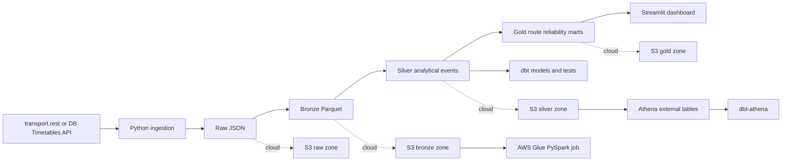
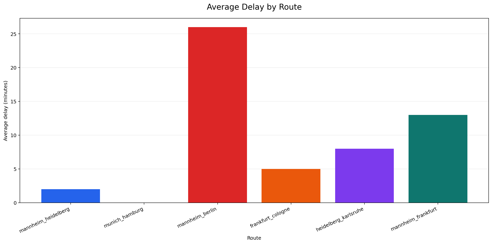
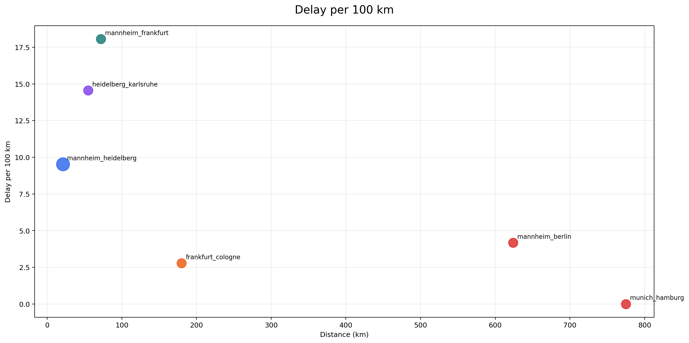
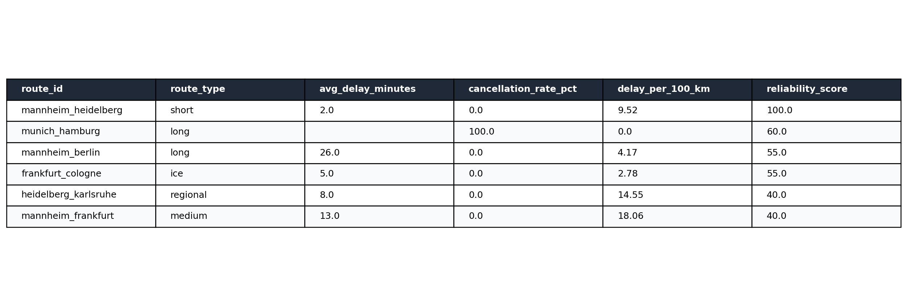

# DB Train Delay and Route Reliability Pipeline

End-to-end data engineering project for collecting German train timetable and delay data, storing raw records, transforming them into analytical tables, and comparing route reliability across short, medium, long, regional, and ICE services.

This repository is built to show practical DE patterns rather than only notebook analysis:

- API ingestion from `transport.rest`
- raw, bronze, silver, and gold data layers
- PySpark transformation module
- dbt models and tests
- AWS-oriented lakehouse design with S3, Glue, Athena, and CI/CD
- Streamlit dashboard over the gold metrics layer

## Why This Project

Train reliability is a good DE problem because it mixes operational events, changing source quality, and multiple analytical views in one pipeline. The project demonstrates how to:

- preserve raw API payloads for replayability
- transform semi-structured transport events into typed analytical tables
- compare service reliability by route length, train category, and disruption signals
- design a local-first workflow that can scale into AWS

## Architecture



## Routes and Metrics

Analysed routes in the sample project:

| Route type | Example |
|---|---|
| Short | Mannheim to Heidelberg |
| Medium | Mannheim to Frankfurt |
| Long | Mannheim to Berlin |
| Long | Munich to Hamburg |
| Regional | Heidelberg to Karlsruhe |
| ICE | Frankfurt to Cologne |

Core metrics:

- average delay
- median delay
- delay frequency
- cancellation rate
- platform changes
- delay per 100 km
- route reliability score
- short vs long route reliability
- ICE vs regional disruption patterns

## What I Ran

The project was executed locally with Python 3.10 in a repo-scoped virtual environment.

Executed successfully:

- `.\.venv\Scripts\python.exe scripts\run_local_pipeline.py`
- `.\.venv\Scripts\python.exe -m pytest`
- `streamlit run dashboard/app.py`

Outputs created:

- `data/local/bronze/train_events.parquet`
- `data/local/silver/train_events.parquet`
- `data/local/gold/route_reliability.parquet`
- `data/local/gold/route_reliability.csv`

## Dashboard Outputs

These images were generated from the same gold-layer dataset used by the Streamlit dashboard after running the local pipeline.







## Key Findings

From the current sample run:

- `mannheim_heidelberg` is the most reliable route in the dataset with `2.0` average delay minutes and no cancellations or platform changes.
- `mannheim_berlin` has the highest recorded average delay at `26.0` minutes, which is consistent with long-distance services carrying more accumulated disruption risk.
- `munich_hamburg` includes a cancellation, which drives reliability down even without a measured departure delay.
- `mannheim_frankfurt` and `heidelberg_karlsruhe` both show platform changes, making them useful examples of operational instability beyond pure delay minutes.

## Why Delays Happened In This Run

The current dataset does not contain root-cause labels such as signal failure, rolling stock issue, weather, or crew shortage, so the project does not claim causal certainty it does not have.

What the data does support:

- long-distance services are more exposed to accumulated delay
- cancellations are a strong reliability hit even when no actual departure timestamp exists
- platform changes are a useful operational disruption indicator
- short routes can still have high normalized delay per 100 km even when their absolute delay is modest

In a production extension, the next step would be to retain and model source remarks or disruption messages from live API responses.

## Data Sources

This project is designed around two source options:

- Deutsche Bahn Timetables API: official DB timetable and change endpoints for station and planned/changed departure data  
  Source: [DB API Marketplace - Timetables](https://developers.deutschebahn.com/db-api-marketplace/apis/product/timetables)
- `transport.rest`: unauthenticated community API for station departures, arrivals, journeys, and stop lookups  
  Source: [v6.db.transport.rest API docs](https://v6.db.transport.rest/api.html)

Current implementation status:

- implemented ingestion client for `transport.rest`
- scaffolded client for the DB Timetables API
- attempted live `transport.rest` ingestion during validation; the service returned HTTP `503` on June 12, 2026, which is a realistic example of why retry handling and raw-layer persistence matter in DE work

## AWS and dbt Design

The cloud target architecture uses:

- S3 for raw and curated zones
- AWS Glue for Spark ETL jobs
- Athena for serverless SQL on curated tables
- dbt-athena for modeling and tests
- GitHub Actions for CI gates

Implementation files:

- Terraform: `infra/terraform/`
- dbt project: `dbt/db_train_delay/`
- Streamlit dashboard: `dashboard/app.py`

Reference docs used for the design:

- [AWS Glue Spark job configuration](https://docs.aws.amazon.com/glue/latest/dg/add-job.html)
- [dbt Athena setup](https://docs.getdbt.com/docs/local/connect-data-platform/athena-setup)

## Local Run

Windows PowerShell:

```powershell
py -3.10 -m venv .venv
.\.venv\Scripts\Activate.ps1
python -m pip install -r requirements.txt
python scripts\run_local_pipeline.py
streamlit run dashboard\app.py
```

Generate README chart assets from the current gold table:

```powershell
python scripts\generate_readme_assets.py
```

## Repository Layout

```text
.
|-- .github/workflows/ci.yml
|-- config/
|-- dashboard/
|-- data/
|-- dbt/
|-- docs/
|-- infra/
|-- notebooks/
|-- scripts/
|-- src/db_train_delay/
`-- tests/
```

## Next Extensions

- capture live API remarks and disruption messages for richer delay-cause analysis
- land raw events to S3 and run the Spark path in AWS Glue
- expose the gold layer through Athena and dbt-athena
- add route-level trend charts over longer collection windows
