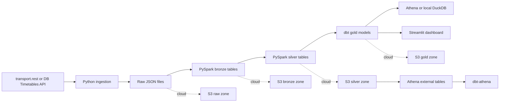

# DB Train Delay and Route Reliability Pipeline

A portfolio-ready data engineering project for collecting German train timetable and delay data, landing it in a lakehouse-style layout, transforming it with PySpark and dbt, and comparing route reliability across short, medium, long, regional, and ICE routes.

The project is designed to run locally with sample data first, then scale to AWS using S3, Glue, Athena, dbt-athena, and CI/CD gates.

## What This Project Shows

- API ingestion from `transport.rest` with a DB Timetables API-compatible extension point
- Raw, bronze, silver, and gold data layers
- PySpark ETL transformations
- dbt models, schema tests, and documentation
- AWS S3/Glue/Athena target architecture
- CI/CD checks for Python, SQL, dbt, and Terraform
- Streamlit dashboard for route reliability comparison

## Architecture



## Route Comparisons

| Route type | Example |
|---|---|
| Short route | Mannheim to Heidelberg |
| Medium route | Mannheim to Frankfurt |
| Long route | Mannheim to Berlin |
| Long route | Munich to Hamburg |
| Regional route | Heidelberg to Karlsruhe |
| ICE route | Frankfurt to Cologne |

Metrics:

- average delay
- median delay
- delay frequency
- cancellation rate
- platform changes
- route duration
- delay per 100 km
- short vs long route reliability
- ICE vs RE/RB reliability
- weekday vs weekend delays
- morning vs evening delays

## Repository Layout

```text
.
├── .github/workflows/ci.yml
├── config/
│   ├── routes.yml
│   └── stations.yml
├── dashboard/
│   └── app.py
├── data/
│   └── samples/
├── dbt/
│   └── db_train_delay/
├── docs/
│   ├── architecture.md
│   └── dashboard_mockup.md
├── infra/
│   └── terraform/
├── notebooks/
├── scripts/
├── src/db_train_delay/
│   ├── ingestion/
│   ├── pipelines/
│   ├── quality/
│   └── utils/
└── tests/
```

## Quick Start

### 1. Create a Python environment

```bash
python -m venv .venv
source .venv/bin/activate
pip install -r requirements.txt
```

On Windows PowerShell:

```powershell
python -m venv .venv
.\.venv\Scripts\Activate.ps1
pip install -r requirements.txt
```

### 2. Run the local sample pipeline

```bash
python scripts/run_local_pipeline.py
```

This reads sample raw train events from `data/samples/raw_transport_rest_departures.json`, writes local bronze/silver/gold outputs under `data/local/`, and creates a route reliability table.

If you have not installed dependencies yet, use the no-dependency demo runner:

```bash
python scripts/run_sample_pipeline_no_deps.py
```

### 3. Run data quality checks

```bash
pytest
```

### 4. Open the dashboard

```bash
streamlit run dashboard/app.py
```

If Streamlit is not installed or you only want screenshots for a portfolio README, see `docs/dashboard_mockup.md`.

## API Ingestion

The default ingestion client uses `transport.rest`, which does not require an API key and is good for a fast prototype.

Example:

```bash
python scripts/ingest_transport_rest.py --station 8000244 --limit 20
```

The code respects a simple request delay and is structured so you can add DB API Marketplace credentials later.

For DB Timetables API, create environment variables:

```bash
export DB_CLIENT_ID="..."
export DB_CLIENT_SECRET="..."
```

Then implement the official client in `src/db_train_delay/ingestion/db_timetables_client.py` using the same raw event contract.

## AWS Version

Target cloud architecture:

```text
API collector
  -> S3 raw zone
  -> AWS Glue PySpark job
  -> S3 bronze/silver curated Parquet
  -> Athena external tables
  -> dbt-athena gold models and tests
  -> Streamlit or Power BI dashboard
```

Terraform templates are in `infra/terraform/` and include:

- S3 data lake bucket
- Glue database
- Athena workgroup
- IAM role placeholders

The files are intentionally safe defaults and should be reviewed before deployment.

## dbt

Local dbt models are under `dbt/db_train_delay/models`.

Core models:

- `stg_train_events`
- `int_route_event_metrics`
- `fct_route_reliability`
- `dim_routes`

Run from the dbt project directory:

```bash
cd dbt/db_train_delay
dbt deps
dbt seed
dbt run
dbt test
```

For AWS, configure a `dbt-athena` profile and point models to Athena external tables over S3.

## CI/CD Gates

GitHub Actions workflow `.github/workflows/ci.yml` includes:

- Python lint check with Ruff
- Unit tests with Pytest
- dbt parse/test placeholder
- Terraform format check

## Possible Outcomes and Images

For GitHub and interviews, you can show:

- architecture diagram from this README
- Streamlit route reliability dashboard
- sample gold table screenshot
- Athena query result screenshot
- AWS S3 zone screenshot after deployment
- dbt lineage graph screenshot

Suggested image workflow:

1. Run `streamlit run dashboard/app.py`
2. Filter a few routes like Mannheim to Heidelberg and Munich to Hamburg
3. Take screenshots for your README
4. Add them to `docs/images/`
5. Reference them from the README

This repo includes `docs/dashboard_mockup.md` describing the exact screenshots to capture.

## Portfolio Story

This project demonstrates how to build an end-to-end data engineering pipeline from live or historical railway data:

1. Ingest raw API data.
2. Preserve immutable raw records.
3. Normalize and enrich train events.
4. Build route-level reliability metrics.
5. Validate outputs with dbt and Pytest.
6. Serve analytics through Athena and a dashboard.
7. Automate checks through CI/CD.
